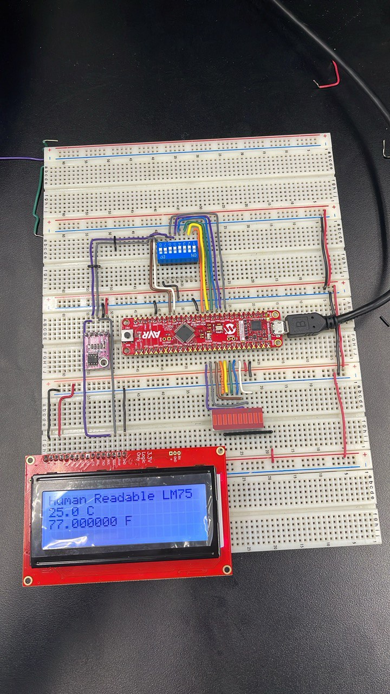

# ESE 381 Code
The following is a GitHub repository where in ESE 381 we wrote a comprehensive code that (ideally) covers everything. Typically, this is the last task code, where the last task requires us to have all the preceding tasks functioning in order to get the last task working.

# Assumptions
As with all code that is written, a few assumptions must be made:
1. The code has been tested to work 100% of the time, but still an assumption.
2. The hardware does not contain any issues or bad wiring, so it will function correctly.

# Wiring Guidelines
The PDFs of all the schematics are made with KiCAD. These will be added soon. In real life, the wiring should have as minimal crossings as possible:

## The guidelines I strictly follow:
- The wiring may have crossings, but at the highest level, it should only have one-crossing. 
- Prefer to wire things "underground" using the breadboard to expose more pins.
- Prefer 90° bent wires whenever possible
- Choose unique colors for all the data bus(es), sorted by ROYGBIV from the __peripheral's__ end!
- Do NOT allow the wires to be too short. Wiring a bit too long is alright, but wiring too short is a pain.

# Primary Use-Case (and Historical preservation statement)
This repository does not have the highest-quality of presentation, and is initially privated because it was originally made to review for an exam. Potential use-cases in the future include being able to use this for future labs to organize code better. It will also allow for future students and maybe even prospective engineers to see example code that is highly readable for the AVR128DB48 microcontroller, with many references to the locations for each reference written in code, to the datasheet to show how each line of code (that is carefully written).

The above paragraph is only written so that in the future, if someone looks through the Git Commit History, they can see the origins of this repository.

# Credit and Attribution
Thanks to Katherine Trusinski for contributing some of the code, and helping out during lab sessions.
Thanks to Bryant Gonzaga for giving tips for wiring
Thanks to Professor Kenneth Short for a great class!
